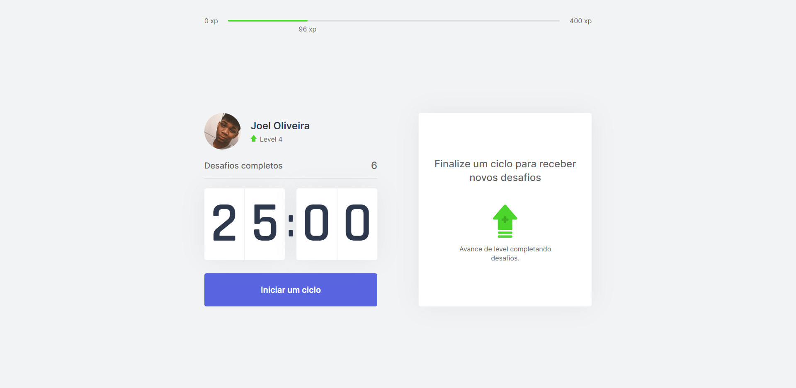

<p align="center">
	<a href="#whats-next-level-week">Next Level Week</a>&nbsp;&nbsp;&nbsp;|&nbsp;&nbsp;&nbsp;
	<a href="#project">Project</a>&nbsp;&nbsp;&nbsp;|&nbsp;&nbsp;&nbsp;
	<a href="#technologies">Technologies</a>&nbsp;&nbsp;&nbsp;|&nbsp;&nbsp;&nbsp;
	<a href="#how-to-use">How to use</a>&nbsp;&nbsp;&nbsp;|&nbsp;&nbsp;&nbsp;
	<a href="#how-to-contribute">How to contribute</a>&nbsp;&nbsp;&nbsp;|&nbsp;&nbsp;&nbsp;
	<a href="#license">License</a>
</p>

## What's Next Level Week?

Next Level Week is a practical week with lots of code, challenges, networking and a single objective: to take you to the next level.

Through our method you will learn new tools, learn about new technologies and discover hacks that will boost your career. An online and completely free event that will help you take the next step in your evolution as a dev.

## Project

Move.it is a project that combines the pomodoro technique with some challenges for the well-being of those who spend many hours using the computer.

## Technologies

This project was developed with the following technologies:

- [Node.js](https://nodejs.org)
- [TypeScript](https://www.typescriptlang.org)
- [Next.js](https://nextjs.org)
- [Tailwind CSS](https://tailwindcss.com)

## How To Use

To clone and run this application, you'll need [Git](https://git-scm.com), [NodeJS](https://nodejs.org/) + [Yarn](https://yarnpkg.com/) installed on your computer.

From your command line:

```bash
# Clone this repository

$ git clone https://github.com/joeldorosarioo/move.it.git

$ cd move.it

# Install dependencies

$ pnpm install

# Activate hooks

$ pnpm husky install

# Run the Development Server

pnpm run dev
```

## How to contribute

- Make a fork;
- Create a branck with your feature: `git checkout -b my-feature`;
- Commit changes: `git commit -m 'feat: My new feature'`;
- Make a push to your branch: `git push origin my-feature`.

After merging your receipt request to done, you can delete a branch from yours.

## License

This project is under the MIT license. See the [LICENSE](/LICENSE) for details.

Made with ♥ by Joel Oliveira. [Get in touch!](https://www.linkedin.com/in/joeldorosarioo/)
